**以下所有命令在Windows下不区分大小写**

### 创建和查询数据库

```mysql
CREATE DATABASE menagerie;//创建数据库menagerie
SHOW DATABASES;//显示当前服务器含有的数据库
```


### 使用数据库和创建表

```mysql
USE menagere;//使用menagerie数据库（把它置为当前）
```


```mysql
CREATE TABLE pet(name VARCAHR(20),owner VARCHAR(20),species VARCHAR(20),sex CHAR(1),birth DATE,death DATE);//创建表pet
SHOW TABLES;//显示当前数据库含有的表
```


```mysql
DESCRIBE pet;//显示表pet详细的属性
```

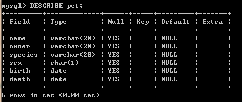

### 加载数据到表中(load&insert）

- `LOAD DATA LOCAL INFILE `

  ```mysql
  LOAD DATA LOCAL INFILE '/path/pet.txt' INTO TABLE pet;//加载pet.txt数据到表pet中
  ```

- Insert  

```mysql
INSERT INTO pet
VALUES('Slim','Benny','bird',NULL,'1997-12-09',NULL);//插入单条记录
```

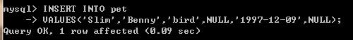

### 检索表中信息（查询）

```mysql
SELECT what_to_select
FROM which_table
WHERE conditions_to_satisfy;
```

- #### 查询所有记录

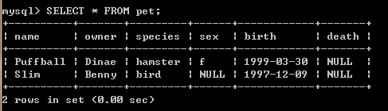

### 编辑（修改）表中数据

- 改正`pet.txt`中的错误，然后使用`DELETE`(删除)和`LOAD DATA`（重新加载）

  ```mysql
  DELETE FROM pet;
  LOAD DATA LOCAL INFILE '/path/pet.txt' INTO TABLE pet;
  ```

- 用`UPDATE`直接修改错误的数据项

  将`Slim`的生日改为`‘1989-08-31’`

  ```mysql
  UPDATE pet SET birth = '1989-08-31' WHERE name = 'Slim';
  ```

  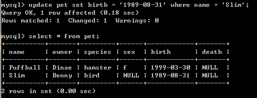

- #### 查询特定的行

  使用`WHERE`来限定范围

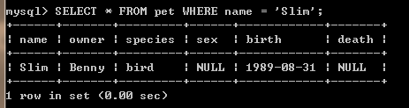

​	`WHERE`中的条件可以使用逻辑运算和不等式

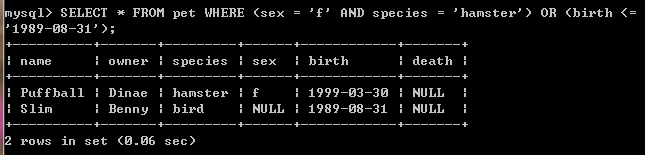

- #### 查询特定的列

  使用关键字`DISTINCT`限定记录只出现一次

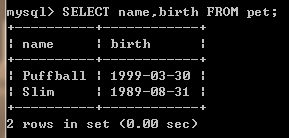

​	使用WHERE限定范围

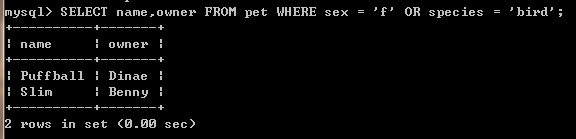

- #### 按行排序

  默认升序

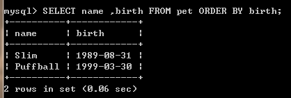

​	降序

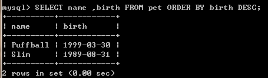

#### 匹配模式

- _`表示任意单个字符
- `%`表示任意多个字符（包括0个字符）
- `LIKE`等效于`=` ，用于模式匹配中
- `NOT LIKE`等效于`<>` ，用于模式匹配中

e.g. 

```mysql
SELECT * FROM pet WHERE name LIKE 'P%'
```

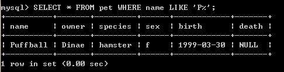

使用**正则表达式（Regular Expression）**进行扩展

用`REGEXP`  和 `NOT REGEXP` ( `RLIKE`和 `NOT RLIKE`)运算符

- `.` 匹配任意单个字符
- `[...]`匹配括号里面的任意一个字符，如`[abc]`匹配`a,b or c`,表示一个范围的字符，用破折号，如`[a-z]`匹配任意一个字母，`[0-9]`匹配任意一个数字。
- `*`  匹配0个或多个它之前的一个字符，如 `x*` 匹配任意数量个`x` 的字符 ， `[0-9]*`  匹配任意正整数，`.*`匹配一切（match a number of anything）
- 匹配以一个字符开头或结尾时，在他前面使用`^`或在他结束时使用`$`

e.g.

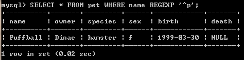

### 删除数据

- #### 删除表中内容

  ```mysql
  DELETE FROM table_name WHERE conditions_to_satisfy;
  ```

- #### 移除表

  ```mysql
  DROP TABLE table_name;//移除表table_name
  ```

- #### 移除数据库

  ```mysql
  DROP DATABASE db_name;//移除数据库db_name
  ```

更多信息参考官网[mysql](https://dev.mysql.com/doc/)